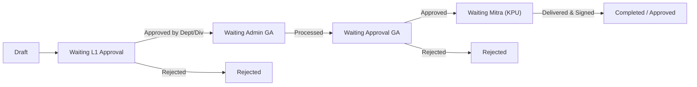
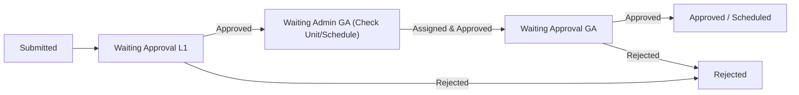

# GAAS Approval Workflow & Permissions Specification

This skill documents the complete authorization matrix and multi-stage approval logic for the General Affair Application Support (GAAS) system.

## 1. User Roles Matrix

No self-registration exists in GAAS; all accounts are seeded (`backend/Data/DbSeeder.cs`).

| Role Code | Level | Description & Responsibilities |
|---|---|---|
| `ADMIN_DEPARTEMEN` | Origin L1 (Dept) | Creates proposals/transmittals on behalf of a Department. Can edit/delete while in DRAFT. |
| `APPROVAL_DEPARTEMEN`| Approver L1 (Dept)| Reviews and approves/rejects proposals from their own Department. |
| `ADMIN_DIVISI` | Origin L1 (Div) | Creates proposals on behalf of a Division (cross-departmental). |
| `APPROVAL_DIVISI` | Approver L1 (Div) | Reviews and approves/rejects proposals from their own Division. |
| `ADMIN_GA` | General Affair | Operates, reviews logistics, performs corrections, assigns drivers/vendors/rooms. |
| `APPROVAL_GA` | GA Management | Final internal General Affair approval sign-off. |
| `KPU` | Mitra / Ekspedisi | External expedition courier partner. Handles transmittal delivery verification and monthly vendor invoices. Only sees Ekspedisi. |
| `SUPER_ADMIN` | System Admin | Master access across all 6 modules, audit trails, and bulk data operations. |

## 2. Module Workflow State Machines

### A. Ekspedisi (Expedition)

### B. Room Booking & Vehicle Booking

### C. Office Supplies (ATK) & Maintenance (Sarana)
Proposals flow through L1 Approval $\rightarrow$ Admin GA (Stock / PaDi UMKM Sourcing / Technician Assignment) $\rightarrow$ Approval GA $\rightarrow$ Completed.

## 3. Rejection & Correction Rules

- **`RejectTarget`**: When a request is rejected by Admin GA or Approval GA, it can target:
  - `ORIGIN`: Returned back to the creator for revision.
  - `TERMINATED`: Outright canceled with non-negotiable rejection note.
- **`canGaKoreksiPengiriman`**: Admin GA is permitted to correct weight, dimension, carrier, or tracking info without canceling the entire shipment.
- **Status Badges**:
  - Yellow/Amber: Waiting approval (`SUBMITTED`, `ON_APPROVAL`).
  - Green: Fully approved (`COMPLETED`, `APPROVED`).
  - Red: Rejected (`REJECTED`).
  - Slate/Gray: `DRAFT`.
